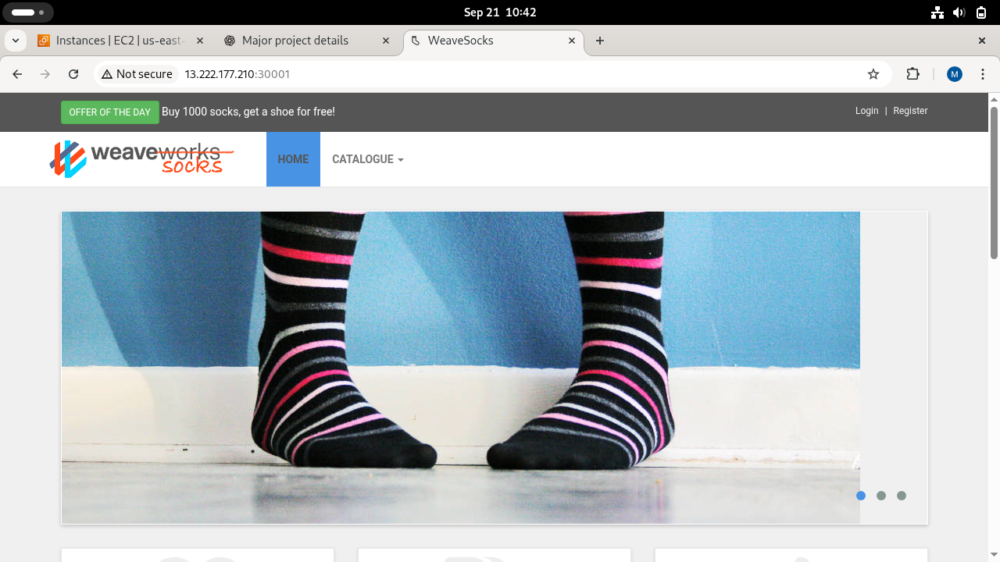

# ☁️ CloudIQ – AI Enhanced Infrastructure for High Availability & Resilience

> Building intelligent, self-healing cloud infrastructure using Kubernetes, Prometheus, Grafana, and automated remediation.

---

## ✨ Overview

**CloudIQ** is a cloud-native infrastructure automation framework designed to ensure **high availability, resilience, and self-healing** of microservices deployed on Kubernetes.  
It continuously monitors system health, detects abnormal behavior, triggers alerts, and automatically performs remediation actions such as **pod restarts and autoscaling**.

The project uses the **Sock Shop microservices application** as a realistic workload to demonstrate how modern cloud systems can recover from failures with minimal human intervention.

This project was developed as a **VTU Major Project (CSE)** and demonstrates real-world DevOps, SRE, and cloud engineering practices.

---

## 🧠 Why CloudIQ?

Modern cloud systems are:
- Highly distributed
- Dynamic and unpredictable
- Difficult to manage manually

Traditional monitoring tools are **reactive** and rely heavily on human operators.

💡 **CloudIQ changes this** by introducing:
- Continuous observability
- Alert-driven automation
- Closed-loop self-healing
- Dynamic autoscaling

---

## 🧩 Core Capabilities

| Capability | Description |
|----------|-------------|
| 📦 Cloud-Native Deployment | Microservices containerized with Docker and orchestrated using Kubernetes |
| 📊 Real-Time Monitoring | Prometheus scrapes CPU, memory, and pod metrics |
| 📈 Visualization & Alerting | Grafana dashboards and alert rules |
| 🤖 Automated Remediation | Custom Remediator service performs corrective actions |
| 🔁 Self-Healing | Automatic pod restart and recovery |
| ⚖️ Autoscaling | Kubernetes HPA scales pods based on CPU utilization |

---

## 🏗️ System Architecture

CloudIQ follows a **closed-loop automation architecture**:

1. Sock Shop microservices run on Kubernetes (EC2)
2. Prometheus collects real-time metrics
3. Grafana visualizes metrics and triggers alerts
4. Alerts are sent to the Remediator service
5. Remediator executes corrective actions
6. HPA scales pods dynamically
7. System returns to stable state

---

## 🛠️ Technology Stack

- **Cloud Platform**: AWS EC2  
- **OS**: Ubuntu 20.04 / 22.04  
- **Containerization**: Docker  
- **Orchestration**: Kubernetes (K3s)  
- **Monitoring**: Prometheus  
- **Visualization & Alerting**: Grafana  
- **Autoscaling**: Kubernetes HPA  
- **Remediation**: Custom Remediator Microservice  
- **Package Manager**: Helm  

---

## 📁 Project Structure

